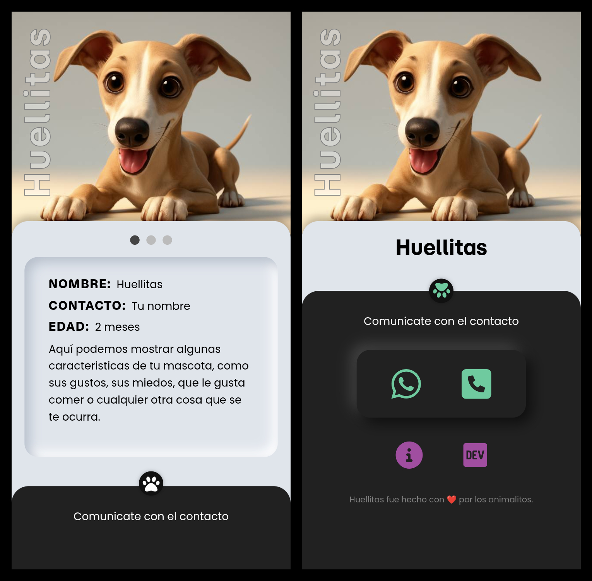

# HUELLITAS APP
  

**huellitas** es un proyecto de identificacion de mascotas a través de un codigo QR.
Cada mascota tendra su tag con un QR que mostrará en el telefono celular algunos datos y el contacto del propietario.

La aplicación la realicé para uso personal al mismo tiempo que fué una excusa para seguir aprendiendo distintas tecnologías.

  🧰 🛠️ huellitas (Backend) fue desarrollado con:
- Intellij IDEA
- Springboot 3.4.11
- Lombok
- JPA/Hibernate
- MySQL
 
 🧰 🛠️ huellitas (Frontend) fue desarrollado con:
- Visual studio code
- HTML5
- CSS
- Vanilla JS

Para tener este proyecto en tu 💻, simplemente tenés que clonarlo (o bajarlo en formato .zip) y listo!! 😊